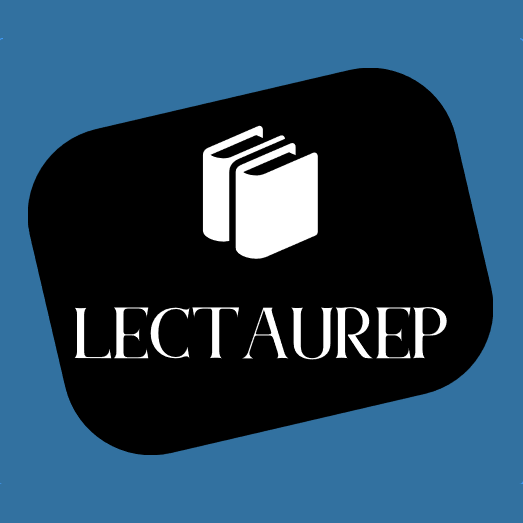

# Notaires de Paris - Répertoires
Ground truth for various Parisian notary's registries of deeds (French 19th and 20th centuries) 

<!-- badges -->
 

<!-- updated by workflow -->
      

<!-- end badges -->

## Contexte de production 

Le projet [LECTAUREP](https://lectaurep.hypotheses.org/) (LECTure Automatique de REPertoires), qui a débuté en 2018, est une initiative conjointe du Minutier central des notaires de Paris des Archives Nationales, de l’équipe ALMAnaCH (Automatic Language Modeling and Analysis &amp; Computational Humanities) à Inria et de l’EPHE (Ecole Pratique des Hautes Etudes), en partenariat avec le Ministère de la Culture.

Le projet vise à repenser l’utilisation actuellement faite des registres des actes notariés, l’une des sources historiques les plus consultées aux Archives nationales, par les chercheurs et les utilisateurs des fonds d’archives notariales. Pour ce faire, le projet a instaurer un workflow de traitement de ces manuscrits à l’aide de la reconnaissance automatique des documents manuscrits (HTR) et d'extraction d’information (NER) en adoptant notamment l'application eScriptorium pour produire la vérité de terrain, entraîner des modèles de reconnaissance et corriger les transcriptions résultants.

Les corpus `lectaurep-repertoires` rassemblent les données d'entraînement spécifiques aux répertoires de notaires. 

## Détail des lots

| Nom                | Importance matérielle | Dates extremes    | Particularité | Notaire  | Identifiant db |
| ------------------ | --------------------- | ----------------- | ------------- | -------- | -------------- |
| lectaurep-rigault6 | 35 pages              | 05/1907 - 03/1908 | 1 seule main  | Rigault  | [#50](https://escriptorium.inria.fr/document/50/images/) (2-37) |

## Règles de transcription

- le texte suscrit a été signalé par un `^` liminaire. Le phénomène "**dudt**" (dudit) est donc transcrit par "dud^t".

- l'emploi des minuscules et majuscules a été respecté.

- les mots agglutinés et ligaturés sont généralement transcrits tels quels.

- les segments correspondant à du texte pré-imprimés sont signalé par le type "printed"

## Les autres dépôts LECTAUREP

<!--➡️ [Lectaurep-repertoires](https://github.com/HTR-United/lectaurep-repertoires)-->

➡️ [Lectaurep-bronod](https://github.com/HTR-United/lectaurep-bronod)

➡️ [Lectaurep-mariages-et-divorces](https://github.com/HTR-United/lectaurep-mariages-et-divorces)

---

<!-- logo institutionnels -->

| Inria                               | Archives nationales                                             |
| :---------------------------------: | :-------------------------------------------------------------: |
|  |  |

